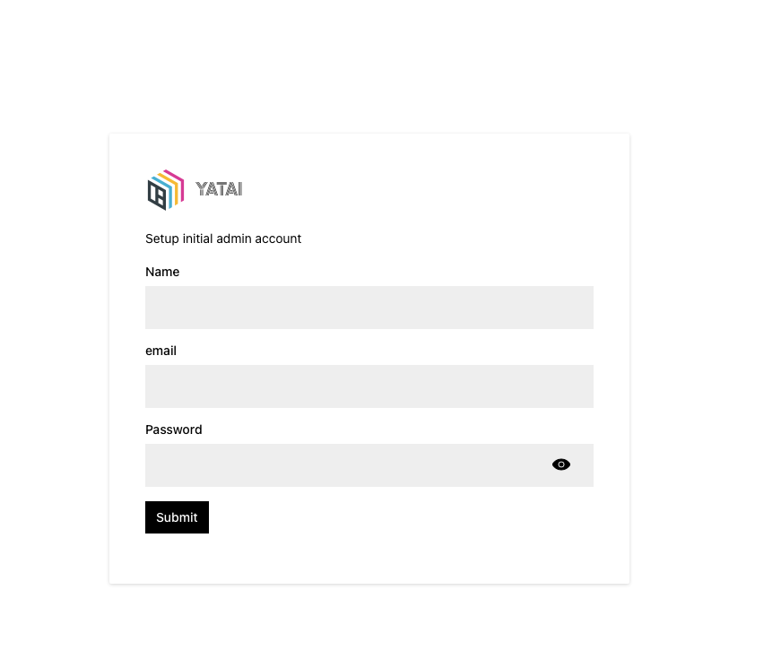
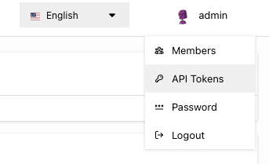
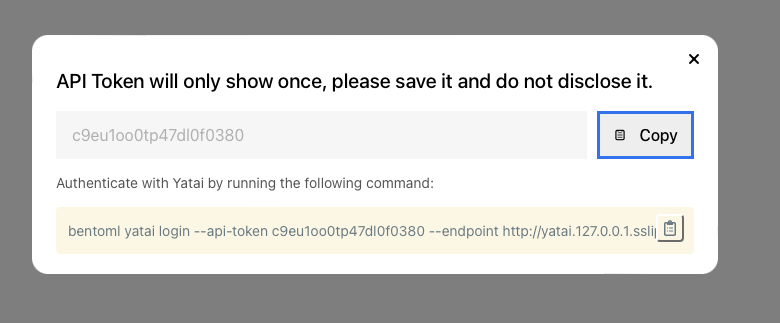

# Yatai user guide


This guide is for user who complete the Yatai installation.

It will walkthrough the steps of setting up Yatai and deploying a new service on it.

Prerequisites:

* A running Yatai server. Make sure you have a running Yatai server before you start this guide. If you are running the Yatai on your local machin with Minikube. Make sure estblished the tunnel with `minikube tunnel` before you start this guide.

* `kubectl` commandline tool. Ensure the `kubectl` context set to the cluster that has the Yatai server.


### 1. Complete the Yatai installation

1. Get access to the setup URL

    Follow the instructions in the [Yatai installation guide]() to get the setup URL.

    If you are the administrator of the cluster, you can use the following command to get the setup URL:

    ```
    helm get notes yatai -n yatai-system
    ```

2. Setup admin account.

    Navigate to the setup URL and fill in the information. Here is a screenshot of the setup form:

    


### 2. Login to Yatai on your local machine

1. Generate API token

    After you complete the Yatai installation, you can login to the Yatai server. Hover over the `profile` icon on the top right corner and click on the `API Tokens` link.

    

    And click on `Create` button on the top right corner to open the API token creation modal. After you successfully create the API token, you can copy the CLI
    commnd for login into Yatai.

    


2. Login to Yatai

    Run the copied command in your terminal to sign into Yatai

    ```
    bentoml yatai login --api-token c9eu1oo0tp47dl0f0380 --endpoint http://yatai.127.0.0.1.sslip.io

    04/18/2022 15:06:48 WARNING  [cli] Overriding existing Yatai context config: default
    04/18/2022 15:06:48 INFO     [cli] login successfully! user: admin, organization: default
    ```

### 2. Push your first bento


### 3. Deploy your first service

### 4. Make prediction with your service

### 5. Update deployment

### 6. Delete deployment

